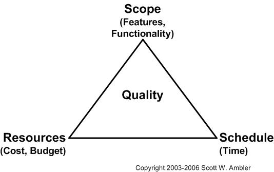

<!--
This file is auto-generated from a 'template.md'
file using the 'md-process' script.
Therefore *DO NOT* edit this file directly!
Instead edit the template file and then run 'md-process'.
-->

# SDLC

## Table of Contents

* [What is Software Development Life Cycle?](#what-is-software-development-life-cycle?)
* [What is the goal of SDLC?](#what-is-the-goal-of-sdlc?)
* [The Software Triangle](#the-software-triangle)
  * [The Iron Pyramid?](#the-iron-pyramid?)
* [Managing Risk](#managing-risk)
* [Traditional Approach - Waterfall](#traditional-approach---waterfall)
* [Why is Waterfall so Attractive?](#why-is-waterfall-so-attractive?)
* [Enter Agile](#enter-agile)
* [For Further Reading](#for-further-reading)

## What is Software Development Life Cycle?

> _SDLC_ is term referring to a process or set of processes for planning, creating, testing, and deploying an software product (i.e. a library, framework, application, website, etc.)

---

## What is the goal of SDLC?

* **Quality**: Ensuring that a high-quality product is built and delivered
* **Scope**: Delivering the _correct_ product
* **Cost**: Estimating and controlling cost

## The Software Triangle

### The Iron Pyramid?

Or simply:

BOTTOM LINE: You get to pick 2 out of 3
## Traditional Approach - Waterfall

Waterfall follows a very *familiar* approach to designing and building a system:

* Figure out what you want
* Design it
* Build it
* Test it
* Ship it
* Enjoy

But *waterfall* is not usually a good fit for large *Software* projects, because certain *assumptions* do not hold.

Waterfall _assumes_ that we know everything we need to know at the beginning of the project:

* What features are needed
* What technologies are a good fit
* How long it will take
* How many developers we need

Waterfall attempts to answer these questions and _lock them down_ near the beginning of the project. 
The reason that these assumptions don't hold for most Software Development projects is because the software industry is *highly volatile*.

* Markets change
* Technologies change
* What seemed like a good idea 3 months ago seems silly or irrelevant now.

We need a process for building software that can *ADAPT* quickly to change!

## Why is Waterfall so Attractive?

Waterfall is attractive because:

* It is familiar - it is how we generally approach big projects
* It is logical, intuitive, and sequential
* It is easy to work when budgeting a project and dealing with legal / contract matters
* It gives the _illusion_ of managing and minimizing risk

## Enter Agile

Agile accepts the fact that everything continues to change at a rapid rate:

* Markets change
* Technology changes
* Culture changes
* Business dynamics change
* Our understanding continues to evolve

> So we must be *agile* in our approach to developing a software solution to a problem.

**The four core values outlined in the Agile Manifesto are:**

_Individual interactions are more important than processes and tools_ 
People drive the development process and respond to business needs. They are the most important part of development and should be valued above processes and tools.

_A focus on working software rather than thorough documentation_
Before Agile, a large amount of time was spent on documenting the product throughout development for delivery. The list of documented requirements was lengthy and would cause long delays in the development process. While Agile does not eliminate the use of documentation, it streamlines it in a way that provides the developer with only the information that is needed to do the work

_Collaboration instead of contract negotiations_ 
Agile focuses on collaboration between the customer and project manager, rather than negotiations between the two, to work out the details of delivery. Collaborating with the customer means that they are included throughout the entire development process, not just at the beginning and end, thus making it easier for teams to meet the needs of their customers. For example, in Agile software development, the customer may be included at different intervals for demos of the product. However, the customer could also be present and interacting with the teams on a daily basis, attending all meetings and ensuring the product meets their desires.

_A focus on responding to change_ 
Traditional software development used to avoid change because it was considered an undesired expense. Agile eliminates this idea. The short iterations in the Agile cycle allow changes to easily be made, helping the team modify the process to best fit their needs rather than the other way around. Overall, Agile software development believes change is always a way to improve the project and provide additional value.

**Agile Manifesto**

1. The highest priority is to satisfy the customer through early and continuous delivery of valuable software.

2. The project team welcomes changing requirements, even late in development. Agile processes harness change for the customer’s competitive advantage.

3. Deliver working software frequently, from a couple of weeks to a couple of months, with a preference to the shorter timescale.

4. Business people and developers must work together daily throughout the project.

5. The process builds projects around motivated individuals, giving them the environment and support they need, and trusts them to get the job done.

6. A face-to-face conversation is the most efficient and effective method of conveying information to and within a development team.

7. Working software is the most important measure of progress.

8. Agile processes promote sustainable development. The sponsors, developers, and users should maintain a constant pace indefinitely.

9. Pay continuous attention to technical excellence, and good design enhances agility.

10. Simplicity is essential. This is the art of maximizing the amount of work not done.

11. Self-organizing teams produce the best architectures, requirements, and designs.

12. At regular intervals, the team reflects on how to become more effective and adjusts its behavior accordingly.

---

---

## For Further Reading

* [DZone RefCard on Scrum](dzone-rc-scrum.pdf)

